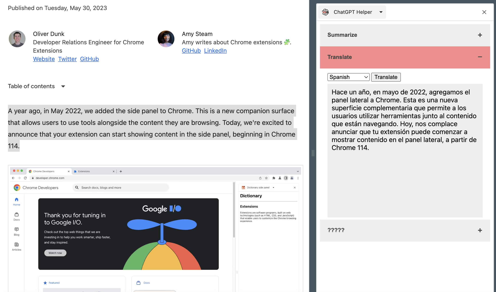

# ChatGPT-Chrome-Extension
Provides some ChatGPT functionality as a chrome extension, accessible via context menu actions

# How to Use
Simply highlight text of interest in any chrome window, right-click and choose the function from the extension's context menu

# Current Functionality
Support summarizing text and translating text into one of 95 different languages

