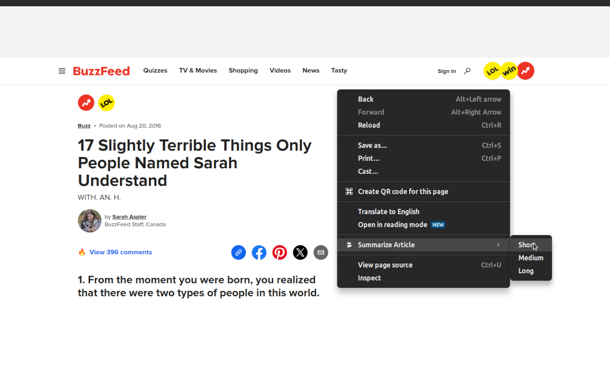
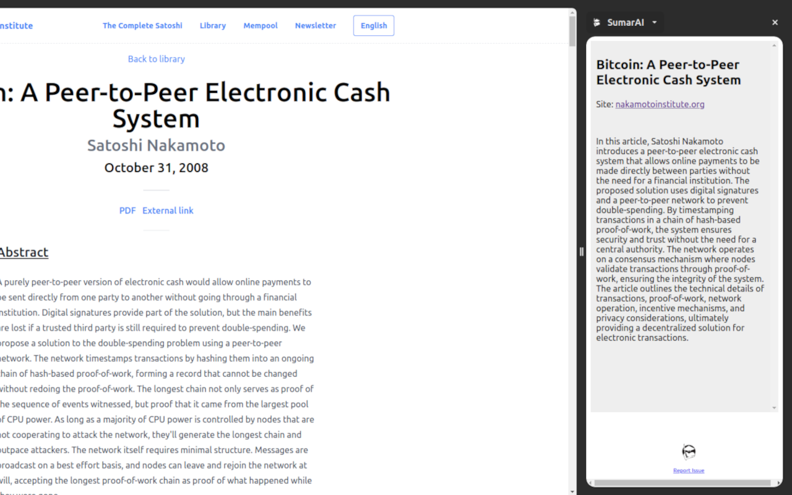

# sumarAI
[Chrome Web Store](https://chromewebstore.google.com/detail/sumarai/mkkjeikhldaeolgmcclafecidaggcacc)

Instantly summarize articles on the web using ChatGPT

SumarAI is a cutting-edge Chrome extension designed to streamline your reading experience. With a simple right-click, it swiftly analyzes the article you're viewing and crafts a beautifully formatted summary tailored to your preferences. Whether you prefer a concise overview or a more detailed synopsis, SumarAI offers three customizable summary lengths: small, medium, and large. What's more, you have the flexibility to select the GPT model that best suits your needs, ensuring accurate and insightful summaries every time.

Transform your browsing experience with SumarAI, your go-to companion for efficient information consumption.

Goodbye TL;DR... Hello TL;AI

# How to Use
Simply right-click on any page you're on, select the summary length, and a detailed page summary will be generated instantly by ChatGPT in a side-panel view

